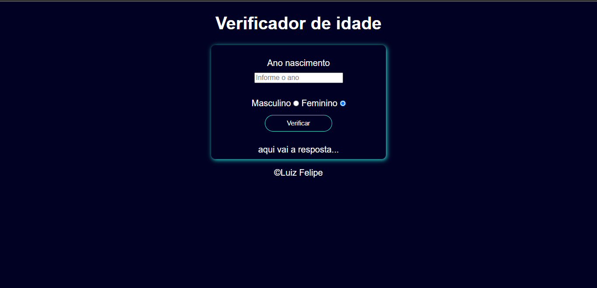

<h1 align="center">Verificador de idade</h1>

Desenvolvido para reforçar conceitos de tecnologias web 

 

 

## Demo
https://verificador.lzfelipe.dev/
 

## 🚀 Tecnologias

Esse projeto foi desenvolvido com as seguintes tecnologias:

- HTML5
- CSS3
- JavaScript

## 💻 Projeto

O Verificador de idade é programa para ajudar usúarios a calcular sua idade, mediante a entrada de dados do mesmo, e em espcial seu ano de nascimento.
 

## 📳 Rodando o projeto
Para rodar este projeto: 
- Clone este repositório
- Acesse a pasta do projeto
- Abra o aquivo `index.html` em seu navegador

